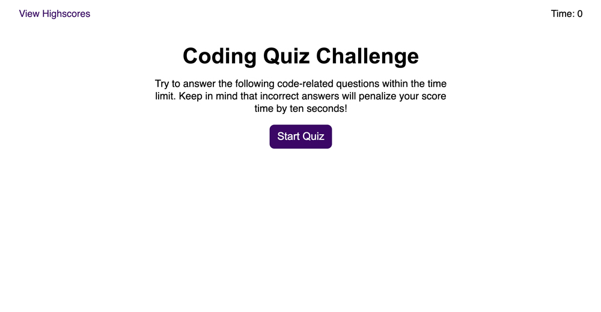
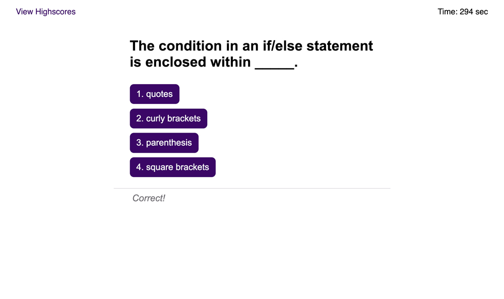

# code-quiz

This is a coding assessment with multiple-choice questions. This app runs in the browser and features dynamically updated HTML and CSS powered by JavaScript code.

Here is the link to the deployed application: [Code Quiz](https://icvalle.github.io/code-quiz/)

The following image shows the web application’s appearance.

